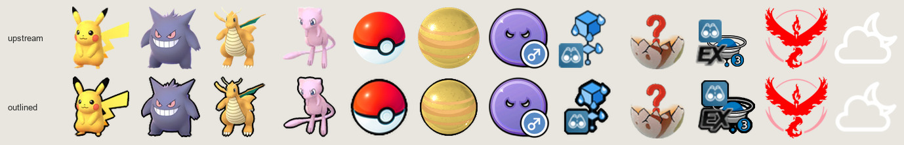

## WWM UICONS webp — outline

A rebuild of the `uicons-outline` icon set that diadem, ReactMap and other UICONS
clients pointed at, after the repository hosting it was deleted in September 2026.

Icons are generated from [WatWowMap/wwm-uicons-webp](https://github.com/WatWowMap/wwm-uicons-webp)
and a scheduled GitHub Action keeps them current with it. The artwork is therefore
upstream's and follows upstream as it changes; the canvas size of each category, and
which categories carry a black stroke, are matched to the original set.



```
https://raw.githubusercontent.com/roundaboutluke/wwm-uicons-webp/main/
```

Currently 15,681 icons across 30 categories, in lossless WebP.

# Using it
Because the geometry matches the original set rather than upstream's, a client config
tuned for the original works unchanged — only the URL differs. For diadem:

```toml
[[client.uiconSets]]
id = "pogoOutline"
name = "GO Outline"
url = "https://raw.githubusercontent.com/roundaboutluke/wwm-uicons-webp/main/"

base = { scale = 0.5 }
pokemon = { default = true, scale = 0.4 }
gym = { default = true, offsetY = -26, offsetX = -14 }
raid_pokemon = { scale = 0.8, offsetX = -11, offsetY = -30 }
raid_egg = { scale = 0.24, offsetX = -25, offsetY = -40 }
```

Paths, filenames and the `index.json` layout follow upstream, so any UICONS client can
read the set. Dimensions do **not** match upstream, so scale values tuned for
`wwm-uicons-webp` itself will render at the wrong size here.

# Geometry
The principle: **artwork from wwm-uicons, everything else from the original set.**
Canvas sizes and stroke decisions were measured from a surviving copy and are applied
per category:

| category | canvas | stroke |
|---|---|---|
| `pokemon` | 93×93 | yes |
| `gym` | 96×96 | yes |
| `pokestop` | 64×64 | yes |
| `reward/candy`, `reward/xl_candy`, `reward/mega_resource` | 93×93 | yes |
| `reward/item`, `reward/experience`, `reward/stardust` | 60×60 | yes |
| `reward/unset` | 128×128 | yes |
| `misc` | per file | 15 of 37 |
| `raid/egg` | 61×70, `_h` 103×103 | no |
| `device` | 48×48 | no |
| `weather`, `spawnpoint` | 64×64 | no |
| `station`, `type` | 128×128 | no |
| `team` | 600×600 | no |
| `background`, `invasion`, `nest` | upstream | no |
| remaining `reward/*` groups | upstream | no |

Sampling 169 icons across the 23 categories present in both sets gives **93% canvas
agreement and 96% agreement on whether a stroke is drawn**. The canvas misses are
`raid/egg`, where the width follows the source artwork's aspect and lands a pixel wide. To re-check against any
surviving copy of the original:

```bash
python3 tools/verify_reference.py \
  --reference https://raw.githubusercontent.com/<a copy>/uicons-outline \
  --upstream /path/to/wwm-uicons
```

# What differs, and why
Two things cannot be reproduced by regenerating from wwm-uicons, and both are worth
knowing before assuming a bug:

**Different source artwork.** The original used its own art for some categories, so the
image differs even though the canvas and stroke match. `gym` is the clearest case: the
original's is a pokeball-and-arrow badge where upstream's is a pedestal. `weather` is
dark teal line art upstream draws in white. `station`, `team` and `type` differ in
content proportions for the same reason. Icons still land at the size a client tuned
for the original expects.

**Files upstream does not have.** The original listed 496 paths absent from
wwm-uicons-webp — 238 `pokemon`, 192 `reward/item`, 19 `pokestop` and others. Nothing can
generate those. UICONS clients fall back to a simpler variant via `index.json`, so they
degrade rather than break. In the other direction this set carries rather more than the
original did, including categories added upstream since.

# How icons are generated
`tools/outline.py` scales a sprite to its category's target size **first**, then draws
the stroke at that final resolution. Stroking before scaling would leave the line
thinner on categories that scale down further — a 3px stroke drawn at 128px becomes
1.4px once an item is scaled to 60×60. Drawing last keeps it a consistent 2px
everywhere, which is what the original did: comparing its plain and outlined copies of
one sprite, content grew from 55×87 to 59×90 at the final canvas size.

The stroke itself grows the sprite's alpha channel by a disc of *n* pixels, fills that
band with the outline colour, and composites the artwork back on top, so every fully
opaque pixel survives untouched and only the antialiased rim blends.

Output is **lossless WebP**. Upstream's WebP is already lossy, and re-encoding lossily
would stack a second generation of artefacts on it — measured at up to 53 levels of
channel error even at quality 100 — for a file barely smaller. Lossless costs about 5%
over a lossy re-encode of the same image and introduces none. Because most categories
scale down, the set is smaller than upstream overall.

Settings live in [`outline.config.json`](outline.config.json):

| key | meaning |
|---|---|
| `enabled` | `false` copies the icon through untouched |
| `outline` | `false` applies the sizing rules but draws no stroke |
| `width` | stroke thickness in px, at the icon's final size |
| `color` | stroke colour, hex |
| `opacity` | 0–1 |
| `solid_at` | how opaque the grown alpha must be before the stroke is solid — lower is crisper |
| `canvas` | centre the result on a square canvas of this size |
| `content` | scale the artwork to this many px on its longer side, cropping its margin first |
| `resize` | scale the whole frame to this many px on its longer side, keeping its margin |
| `mode` | used only when no sizing rule applies: `fit`, `expand`, `inset` or `clip` |
| `shadow` | `null`, or `{"dx":0,"dy":2,"blur":2,"color":"#000000","opacity":0.45}` |

`categories` overrides any of those per folder, subfolder, exact file path, or glob.
Longest match wins and globs apply last, which is how `raid/egg/*_h.png` refines
`raid/egg`.

Try a change before committing to it:

```bash
python3 tools/outline.py --src /path/to/upstream --dst /tmp/try --config outline.config.json \
  --only pokemon/25.png --only raid/egg/1.png
```

# Staying in sync
`tools/sync_upstream.py` clones upstream, hashes every source PNG against
`.outline-manifest`, then re-renders **only** the icons that changed, deletes the ones
upstream dropped, and rebuilds the indexes.

```bash
python3 tools/sync_upstream.py            # incremental
python3 tools/sync_upstream.py --dry-run  # show what would change
python3 tools/sync_upstream.py --full     # re-render everything
```

[The Action](.github/workflows/sync-upstream.yml) runs it daily, on demand, and on any
push touching the style or the generator. An unchanged upstream is a no-op that produces
no commit. Editing `outline.config.json` or `tools/outline.py` changes the recorded
build hash, which makes the next run rebuild the whole set by itself — so restyling is a
one-line commit and the Action does the rest.

Only icons are synced from upstream; the tooling, workflow and this README are
fork-local. `index.js` carries one change from upstream: an ignore list so `tools/` and
`docs/` stay out of the generated indexes.

# Image Credits
- [Mygod](https://github.com/Mygod)
- [whitewillem](https://github.com/whitewillem)
- [Pokeminers](https://github.com/PokeMiners)
